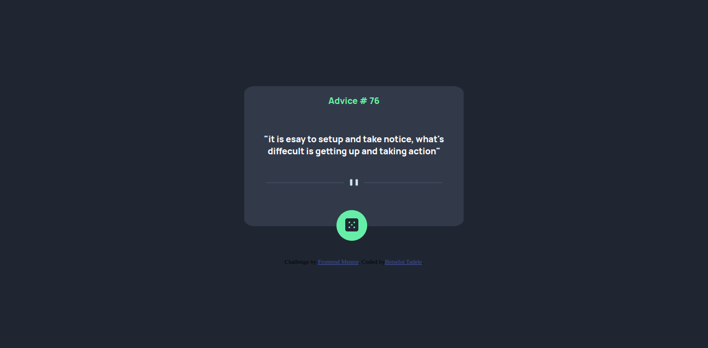
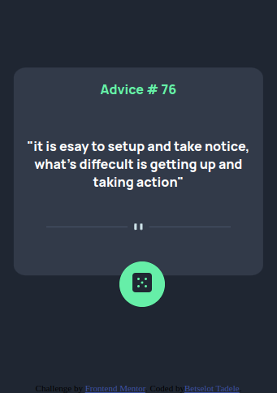

# Frontend Mentor - Advice generator app solution

This is a solution to the [Advice generator app challenge on Frontend Mentor](https://www.frontendmentor.io/challenges/advice-generator-app-QdUG-13db). Frontend Mentor challenges help you improve your coding skills by building realistic projects.

## Table of contents

- [Overview](#overview)
  - [The challenge](#the-challenge)
  - [Screenshot](#screenshot)
  - [Links](#links)
- [Author](#author)

## Overview

### The challenge

Advice generator app challenge on Frontend Mentor
### Screenshot 

### Links

- Solution URL: [Add solution URL here](https://github.com/betsigit/advice-generetor.git)
- Live Site URL: [Add live site URL here](https://betsigit.github.io/advice-generetor/)

### Built with

- Semantic HTML5 markup
- CSS custom properties
- JS

## Author

- Frontend Mentor - [@bestigit](https://www.frontendmentor.io/profile/betsigit)

